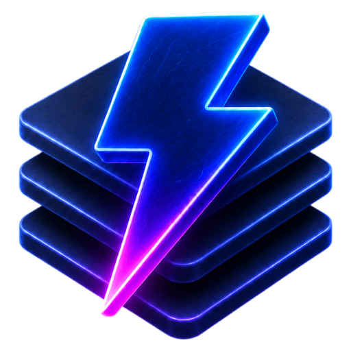

<p align="center">
  
</p>

# bunderstack

**Your whole backend as a single file declaration.** Database, auth, CRUD,
storage, jobs, email, and realtime are keys on one object. `bun run dev` starts
all of it with nothing to configure. Small enough to fit in your agent's
context, and in your head.

- **One place to look.** Every facility is a key, not a service to stand up.
  Turning on file uploads is a `storage` key; turning on realtime is
  `realtime: true`. There is no wiring between them to write, and no dashboard
  holding the other half of the answer.
- **No local setup.** No docker-compose, no local Postgres, no S3 emulator, no
  queue broker, no auth service to point at. One command, one process.
- **The dev/prod gap is a config value.** Storage moves from disk to S3, the
  database from SQLite to Postgres, email from your console to a real sender.
  The code that uses them does not change.
- **Small enough for an agent to read all of it.** The backend of the
  [todo example](examples/todo) is 439 lines across five files — accounts,
  generated CRUD with access rules, uploads with resizing, a cron job,
  transactional email, and a live stream. An agent can read the whole system
  before it changes any of it.

Everything is inferred from that one declaration, so the HTTP API, the typed
client, and the realtime stream cannot drift apart — there is no second copy of
the contract to keep honest. The application exposes one Web Standard
`Request → Response` handler.

```sh
bun add bunderstack better-auth drizzle-orm valibot @libsql/client
```

```ts
import { createBunderstack } from 'bunderstack'
import { libsql } from 'bunderstack/database/libsql'
import { provision } from 'bunderstack/provision'
import * as v from 'valibot'
import * as schema from './schema'

export const app = await createBunderstack({
  schema,
  database: { adapter: libsql(), url: 'file:./data.db' },
  auth: { emailAndPassword: { enabled: true } },
  access: {
    posts: {
      ownerColumn: 'userId',
      list: 'public',
      get: 'public',
      create: 'authenticated',
      update: 'owner',
      delete: 'owner',
    },
  },
  realtime: true,
  api: (o) => ({
    greeting: o.public
      .route({ method: 'GET', path: '/api/greeting' })
      .input(v.object({ name: v.string() }))
      .handler(({ input }) => ({ message: `Hello, ${input.name}` })),
  }),
})

await provision(app)
Bun.serve({ fetch: app.handler })

export type App = typeof app
```

## Package Architecture (0.21+)

All capabilities are unified in the single `bunderstack` package. Import client, query, sync, and start tools via subpaths:

```ts
import { createClient } from 'bunderstack/client'          // Framework-neutral RPC & LiveView
import { createClient as createQueryClient, syncRealtime } from 'bunderstack/query' // TanStack Query
import { createSyncClient } from 'bunderstack/sync'           // TanStack DB collections
import { bunderstackStart } from 'bunderstack/start'          // TanStack Start full-stack helpers
```

## One API graph

The graph is a consequence of the declaration, not a thing you assemble.

Every generated table has `list`, `get`, `create`, `update`, and `delete`
procedures. Application procedures declared under `api` join those procedures,
file buckets, health, and `realtime.changes` in the same router. The graph is
available through both `/api/rpc/*` and routed HTTP projections declared with
`.route(...)`.

There is no framework router to compose and no separate custom-procedure
client. Better Auth keeps its provider-defined `/api/auth/*` routes; everything
else is dispatched by Bunderstack's Web Standard handler.

```ts
import { QueryClient, useQuery } from '@tanstack/react-query'
import { createClient } from 'bunderstack/query'
import type { App } from './bunderstack'

export const queryClient = new QueryClient()
export const api = createClient<App>({ queryClient })

const posts = useQuery(
  api.posts.list.queryOptions({
    input: { limit: 20, sort: 'createdAt', order: 'desc' },
  }),
)

// CRUD update uses direct flat inputs
await api.posts.update.call({ id: 'post_123', title: 'Updated Title' })
await api.posts.create.call({ title: 'Typed end to end' })
await api.greeting.call({ name: 'Ada' })
```

Handler return inference is the usual output contract. Add `.output(schema)`
when runtime output validation, exact OpenAPI output, binary/detailed output,
or an event iterator requires it.

## Standard Schema validation

Public validation slots accept the Standard Schema interface. Valibot is the
default and is used internally, but another compatible schema library can be
used for application inputs. Boot-time env and job validation must be
synchronous.

```ts
env: {
  server: { API_KEY: v.pipe(v.string(), v.minLength(1)) },
  client: { PUBLIC_APP_NAME: v.optional(v.string(), 'My app') },
}
```

## Webhooks

A webhook is an ordinary routed oRPC procedure on the unauthenticated
`o.webhook` base. It supports provider-specific POST paths and typed payloads
without another router.

```ts
api: (o) => ({
  stripeWebhook: o.webhook
    .route({ method: 'POST', path: '/api/webhooks/stripe' })
    .input(stripeEventSchema)
    .handler(async ({ input, context }) => {
      // For signature schemes that require the exact bytes:
      const rawBody = await context.getRawBody()
      await handleStripeEvent(input, rawBody)
      return { received: true }
    }),
})
```

`context.getRawBody()` is lazy and memoized, so signature verification sees
the original bytes. `o.protected` is available for session-authenticated
procedures; all procedure failures use the shared typed Bunderstack error map.

## Realtime with oRPC Publisher

CRUD writes publish access-filtered row changes automatically. Custom writes
publish the complete returned row after the transaction commits:

```ts
await context.realtime.publish(schema.posts, 'update', post)
```

The client consumes the typed `realtime.changes` async iterator. Publisher
metadata carries event IDs, resumable delivery, and reconnect state; there is
no client registration or separate subscription POST protocol.

Idle streams carry a transport-only `heartbeat` every five seconds so Bun and
intermediate HTTP servers keep the response open. The query client monitors
heartbeats and automatically reconnects if the connection drops.

```ts
import { syncRealtime } from 'bunderstack/query'

const realtime = syncRealtime({
  api,
  queryClient,
  tables: ['posts', 'comments'],
  notifyScheduler: 'frame', // batches cache flushes via requestAnimationFrame
  apply: 'patch',           // patches cached list queries in-place
})

realtime.close()
```

`realtime: true` uses the in-memory Publisher. Use
`realtime: { redis: process.env.REDIS_URL! }` when web and worker processes or
multiple instances must share events. `app.realtime.transport` reports
`disabled`, `memory`, or `redis`.

## Live views

`GET /api/live/{table}` is one list query as a stream. It opens with a snapshot
of the result and then sends only the changes that belong to that result: the
server decides membership against the view's filters and places every row, so
the browser holds no cache and never repeats the sort.

```ts
import { createLiveView } from 'bunderstack/client'

const view = createLiveView<Todo>('/api/live/todos', {
  input: { sort: 'createdAt', order: 'desc', limit: 100 },
})

view.subscribe(() => render(view.getRows(), view.getStatus()))
view.patch((rows) => {
  rows[0] = { ...rows[0], done: true } // optimistic; the echo replaces it
})
view.close()
```

`bunderstack/client` has no dependencies and no framework binding. Native UI bindings are available for React (`bunderstack/client/react`), Solid (`bunderstack/client/solid`), Vue (`bunderstack/client/vue`), and Svelte (`bunderstack/client/svelte`).

## Files

Configured buckets are generated under `api.files.<bucket>` and have typed
upload, download, confirmation, and deletion procedures:

```ts
const uploaded = await api.files.avatars.upload(file)
const url = api.files.avatars.url(uploaded.fileId, { w: 160, format: 'webp' })
await api.files.avatars.delete(uploaded.fileId)
```

## Email journal

Configured email is always recorded in `_bunderstack_emails`. Without a
provider, messages are captured locally and are not delivered. With Resend or a
custom adapter, the same row advances through sending and provider delivery
states; `_bunderstack_email_events` keeps the provider event history. Managed
Bunderhost deployments can supply the Resend credentials and sender without
putting provider keys in application code.

## Optional OpenAPI

Set `openapi: true` to serve `/api/openapi.json`. It is intentionally optional:
the native oRPC graph and its TypeScript client work without a JSON Schema
converter. Routed procedures are also convenient for generated mobile clients
and third-party HTTP integrations.

## TanStack DB collections

`bunderstack/sync` layers optimistic TanStack DB collections over the same
oRPC client:

```ts
import { createSyncClient } from 'bunderstack/sync'

const sync = createSyncClient<App>({ queryClient })
const posts = sync.posts.collection
const feed = sync.posts.scopedCollection({
  filters: { replyToId: null },
  sort: 'createdAt',
  order: 'desc',
})
await feed.loadMore()
```

Generated CRUD returns the canonical changed row. `bunderstack/sync` writes
that response into every materialized view without a follow-up list refetch;
the later realtime echo is an idempotent confirmation. Updates to the same row
are coalesced while a request is in flight, which keeps cursor-like optimistic
writes responsive without building a request queue in application code.

## Deployment and lifecycle

Generate and commit the provider-neutral deployment contract with:

```sh
bunx bunderstack blueprint
bunx bunderstack blueprint --check
```

### Production container contract

Bunderstack does not require a particular Dockerfile layout. A production
image must:

- contain the built server and production dependencies;
- include any operating-system packages the application needs;
- start the application using its image command (`bun dist/server/server.js`);
- listen on `0.0.0.0` and the hosting platform's `PORT`;
- expose the application's `/api/health` route;
- receive database, storage, auth, and application configuration at runtime;
- run jobs and cron in-process unless the host deliberately selects another
  supported `BUNDERSTACK_ROLE`.

For TanStack Start and Bun full-stack applications, add `src/server.ts` to serve static assets from `dist/client` in production.

[Bunderhost](https://github.com/kirill-dev-pro/bunderhost#custom-application-image)
generates a standard production image by default. When an application needs OS
packages such as Chromium or custom image construction, Bunderhost instead uses
a committed repository-root `Dockerfile.bunderhost` unchanged.

Examples live in [`examples`](./examples), including Agent Chat, Todo, Twitter, Kanban,
TanStack DB, and tldraw applications.

## Migration Guides

- [Migrating to 0.21](docs/MIGRATION-0.21.md) — Single-package consolidation, subpath exports, direct CRUD inputs, and production server entry.
- [Migrating to 0.17](docs/MIGRATION-0.17.md) — Unified oRPC procedure graph, Standard Schema, and typed filters.
- [Migrating to 0.16](docs/MIGRATION-0.16.md) — Initial module-scope API builders and runtime contracts.

## Development

```sh
bun install
bun run test
bun run typecheck:all
```

Every notable user-facing change must update the root `[Unreleased]` section
of [`CHANGELOG.md`](./CHANGELOG.md).

## License

MIT
